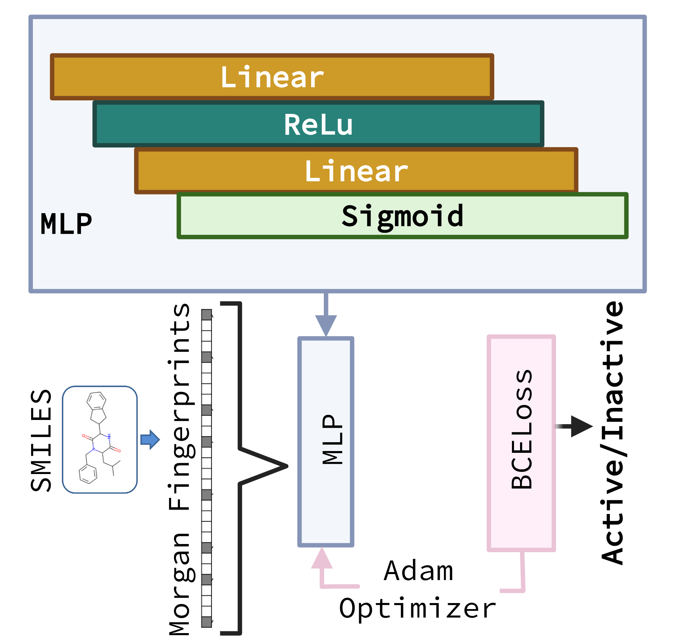

# MF-DNN: Molecular Fingerprint–Deep Neural Network

This repository contains the implementation of **MF-DNN**, a deep learning model developed to aid in the discovery of novel **SARS-CoV-2 nsp13 helicase inhibitors**, including the identification of **MWAC-3429 hits**.  

MF-DNN was primarily used as a **pre-filtering model** in the drug discovery pipeline to prioritize compounds from large virtual screening (VS) libraries for downstream simulation and experimental validation.

---

## Overview

MF-DNN combines **Morgan fingerprints** (ECFP-like circular fingerprints) with a **fully connected feed-forward neural network** trained to discriminate between active and inactive compounds.  

The workflow:

1. Generate **1024-bit Morgan fingerprints** (radius 4) from SMILES strings.  
2. Train MF-DNN using active/inactive labeled compounds.  
3. Apply trained model to blind and evaluation sets.  
4. Output predictions for compound prioritization.  

<p align="center">
  
</p>

*Figure 1. MF-DNN architecture used in this study.*


---

## Key Features

- **Input**: SMILES strings → Morgan fingerprints  
- **Architecture**:  
  - Input layer (1024 bits)  
  - Hidden layer (32 units, ReLU)  
  - Output layer (Sigmoid)  
- **Loss**: Binary Cross-Entropy  
- **Optimizer**: Adam (LR=0.0001, weight decay=0.001)  
- **Training**: 70 epochs, batch size = 8  
- **Metrics**: Accuracy, F1 score, ROC-AUC, Confusion matrix  

---

## Repository Contents

Files for MF-DNN predictor
- `main_Code.py` → Model implementation and training pipeline  
- `decoys_scores.csv`, `top36_dataset_filtered.csv` → Training datasets  
- `for_blind_nluc.csv` → Blind test set
- 'unique_compounds.csv' → VS MWAC-2380, MWAC-2381 and MWAC-2384 VS analogs 
Files as part of the Associated content for MD simulations (parameter, starting poses and representative PDB coordinates) and analysis (clustering, contacts, MM/GBSA calculations)
- `simulation_inputs.zip` → Input files required for molecular simulations  

---

## Quickstart

### 1. Create Environment

```bash
conda create -n mfdnn python=3.9 -y
conda activate mfdnn
```
### 2. Install Dependencies
```bash
conda install -c conda-forge rdkit -y
pip install torch torchvision torchaudio
pip install pandas numpy scikit-learn matplotlib seaborn

```
## Usage

### 1. Training & Blind Set Evaluation and Prediction

```bash
python main_code.py
